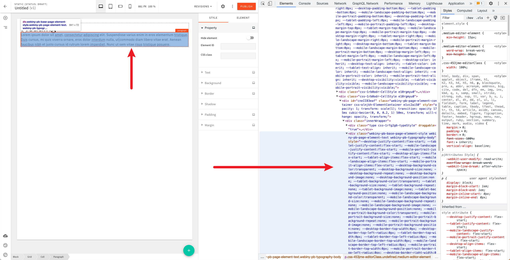

# Page Builder - Legacy Page Rendering Engine Development

## Introduction

With [5.34.0](https://www.webiny.com/docs/release-notes/5.34.0/changelog#page-elements-a-brand-new-page-rendering-engine-2898), we've released a new page rendering engine for our Webiny's Page Builder app.

At the moment, our development repository is set up to use the new page rendering engine and this is fine for the most part. But, from time to time, there will be code changes that will require us to test the legacy page rendering engine as well. Most often, we'll want to test that we didn't break something and that the legacy page rendering engine still works as expected.  

This document outlines the steps necessary to enable the legacy page rendering engine, so that testing can be performed.

## Steps

The first step is to open your `webiny.ts` file, and set the `pbLegacyRenderingEngine` feature flag to true. 

```ts
// webiny.ts
{
    // (...)
    
    featureFlags: {
        // Enforces usage of legacy PB page elements rendering engine.
        // To migrate to the latest one, please read:
        // https://www.webiny.com/docs/page-builder-rendering-upgrade
        pbLegacyRenderingEngine: true
    }
}
```

Once that's enabled, the next step is bringing back the legacy application code within the `apps` folder.

This can be done by simply replacing the `apps/theme` folders with the 5.33.5 version one, found here: https://github.com/webiny/webiny-js/tree/v5.33.5/apps/theme

Once the replacement has been made, these are the manual fixes that will need to be applied (last tested 2023-03-06):

#### 1. `apps/admin/src/App.scss:16`

Change the following import: 

```ts
import "~theme/global.scss";
```

...to the following: 

```ts
import "~theme/styles.scss";
```

#### 2.`apps/theme/pageBuilder/components/Menu.tsx:7` 

Remove the global declaration:

```ts
declare global {
    // eslint-disable-next-line
    namespace JSX {
        interface IntrinsicElements {
            "ps-tag": {
                key?: string;
                value?: string;
            };
        }
    }
}
```

--- 

Ultimately, you should be able to start the Admin/Website apps, with Page Builder pages being rendered with the legacy page rendering engine.

> **NOTE**
> 
> Note that once the switch has been made, it's not expected for the pages created with the new page rendering engine to looks visually correct. Visual errors are to be expected, so, for testing, new pages should be created.

## Is It Working?

In order to ensure you're actually using the legacy page rendering engine, in the page editor, simply add an element to a page and inspect its HTML. It should look something like the following:

