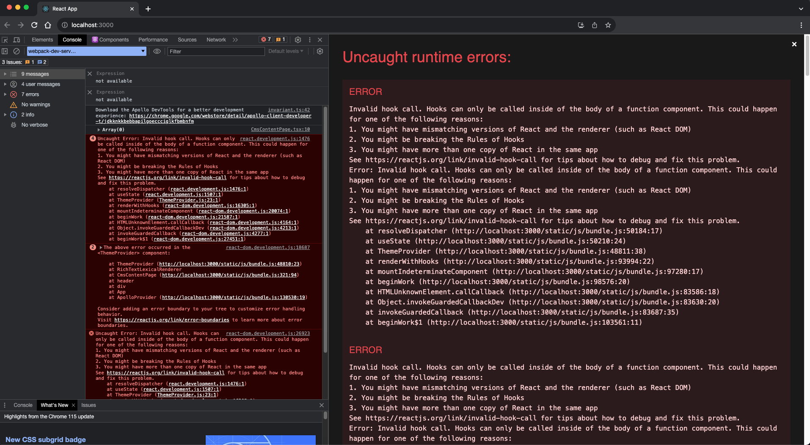

# @webiny/react-rich-text-lexical-renderer

[](https://www.npmjs.com/package/@webiny/react-rich-text-lexical-renderer)
[](https://www.npmjs.com/package/@webiny/react-rich-text-lexical-renderer)
[](https://github.com/prettier/prettier)
[](http://makeapullrequest.com)

A React component to render lexical editor data coming from Webiny Headless CMS and Webiny Form Builder.

## About

Webiny uses Lexical editor https://lexical.dev/ as a go to Rich Text Editor, with some additional plugins. To speed up
the rendering of data for developers, we created this component.

## Install

```
npm install --save @webiny/react-rich-text-lexical-renderer
```

Or if you prefer yarn:

```
yarn add @webiny/react-rich-text-lexical-renderer
```

## Usage

Fetch your data from Headless CMS, then pass it to the component like this:

```tsx
import {RichTextRenderer} from "@webiny/react-rich-text-renderer";

// Load content from Headless CMS (here we show what your content might look like).
const content = {
    root: {
        children: [
            {
                children: [
                    {
                        detail: 0,
                        format: 0,
                        mode: "normal",
                        style: "",
                        text: "A well written paragraph of text can bring so much joy!",
                        type: "text",
                        version: 1
                    }
                ],
                direction: "ltr",
                styles: [],
                format: "",
                indent: 0,
                tag: "p",
                type: "paragraph-element",
                version: 1
            }
        ],
        direction: "ltr",
        format: "",
        indent: 0,
        type: "root",
        version: 1
    }
}

// Mount the component
<RichTextLexicalRenderer value={content}/>;
```

## Adding your custom lexical nodes for rendering

You can add custom lexical nodes for rendering your content:

```tsx

class MyCustomNode extends LexicalNode {
...
}

// Mount the component
<RichTextLexicalRenderer value={content} nodes={[MyCustomNode]}/>;
```

## Adding your custom typography theme.

You can override Webiny default typography theme that is used by lexical editor by providing your custom typography
object.

Please [ read our docs ](https://www.webiny.com/docs/page-builder/theming/theme-object) and check
our [theme object on GitHub](hhttps://github.com/webiny/webiny-js/blob/v5.35.0/packages/cwp-template-aws/template/common/apps/theme/theme.ts)
before add you custom theme.

```tsx

const myTheme = {
    styles: {
        typography: {
            headings: [
                {
                    id: "custom_heading1",
                    name: "Custom Heading 1",
                    tag: "h1",
                    styles: {...headings, fontWeight: "bold", fontSize: 48}
                }]
        }
    }
}

// Mount the component
<RichTextLexicalRenderer value={content} theme={myTheme} nodes={[MyCustomNode]}/>;
```

## Resolve the mismatch of the versions in the React v18 application

When you try to use `RichTextLexicalRenderer` component in React `v18` application you will see this error on the
screen:



This is because our `@webiny/react-rich-text-lexical-renderer` package and the React application have
different versions of React. Our rich text renderer component is using `v17.0.2`, and the React application is
using `v18.x.x`.

> You can check the React version dependencies by running following command:
> - `yarn why react` for `yarn` users.
> - `npm ls react` for `npm` users.

To resolve this problem, we need to define the versions of the `@webiny/react-rich-text-lexical-renderer`
package, and it's dependencies to `v18.x.x`.

### Instructions for `yarn` users

To define the `v18.x.x` of React to all package dependencies that use the old version of React, we need to
add `resolutions` field in `package.json` file.

```json package.json
{
  ...
  "resolutions": {
    "react": "18.x.x"
  },
  ...
}
```

After, run `yarn install` in your terminal, and `@webiny/react-rich-text-lexical-renderer` package and inside
dependencies will be at your specified `v18.x.x` version.

To learn more about the `resolutions` field, please check
this [yarn documentation article](https://classic.yarnpkg.com/lang/en/docs/selective-version-resolutions/).

### Instructions for `npm` users

The `npm` supports the same functionality as `yarn` with the `overrides` field name. You need to add `overrides`
field in `package.json` file.

```json package.json
{
  ...
  "overrides": {
    "react": "^18.x.x"
  },
  ...
}
```

After, run `npm install` in your terminal, and `@webiny/react-rich-text-lexical-renderer` package and inside
dependencies will be at your specified `v18.x.x` version.

To learn more about the `overrides` field, please check
this [npm documentation article](https://docs.npmjs.com/cli/v9/configuring-npm/package-json#overrides).

